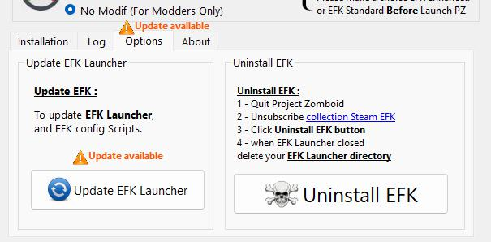

# EFK Launcher

Programme destiné a faciliter l'installation et l utilisation du Mod Escape from Knox County
sur le jeu Project Zomboid.

## Installer EFK Launcher :

* recuperer la derniere version sur  [Releases · ChristopheTdn/EFK-Launcher · GitHub](https://github.com/ChristopheTdn/EFK-Launcher/releases)
* telecharger la derniere release
* Decompacter l archive sur votre disque dur
* Lancer l'executable **EFKLauncher.exe**
* si besoin effectuer une mise a jour a cliquant sur Maj EFK Launcher dans le tab Option.

## Parametrer EFK Launcher

pour vous aider une video tuto existe afin de vous permettre d'installer le Mod Escape From Tarkov

video de presentation : [https://su66.fr/ftp/efk_zik.mp4](https://su66.fr/ftp/efk_zik.mp4 "https://su66.fr/ftp/efk_zik.mp4")

---

# COMPILER EFK Launcher

## Installer l environnement de developpement :

### Visual Studio Code :

J'utilise pour developper l EFK Launcher [Visual Studio Code](https://code.visualstudio.com/ "Visual studio Code de microsoft").

EFK Launcher etant écrit en python je vous invite a utiliser un environnement virtuel en utilisant venv.

Dans VS Code, les extensions necessaires pour developper, editer et compiler EFK Launcher sont :

* [Python Development Extensions Pack](https://marketplace.visualstudio.com/items?itemName=demystifying-javascript.python-extensions-pack)
* [QT for Python](https://marketplace.visualstudio.com/items?itemName=seanwu.vscode-qt-for-python)

to be continued...

# FAQ :

How can i install EFK Launcher / Comment installer l EFK Launcher ? :

Go to [Releases · ChristopheTdn/EFK-Launcher · GitHub](https://github.com/ChristopheTdn/EFK-Launcher/releases)

* Download last release
* unpack zip file on your disk
* launch **EFKLauncher.exe**

recuperer la derniere version sur  [Releases · ChristopheTdn/EFK-Launcher · GitHub](https://github.com/ChristopheTdn/EFK-Launcher/releases)

* telecharger la derniere release
* Decompacter l archive sur votre disque dur
* Lancer l'executable **EFKLauncher.exe**

### How can i Configure EFK Launcher / Comment configurer l' EFK Launcher ?  :

Have a look to this tutorial Video
[https://su66.fr/ftp/efk_zik.mp4](https://su66.fr/ftp/efk_zik.mp4 "https://su66.fr/ftp/efk_zik.mp4")

Visualiser la video explicative de configuration et installation du mod :
[https://su66.fr/ftp/efk_zik.mp4](https://su66.fr/ftp/efk_zik.mp4 "https://su66.fr/ftp/efk_zik.mp4")

Alternative link for the video / Lien alternatif pour la video :  [Launcher description and Escape From Knox County Installation (youtube.com)](https://www.youtube.com/watch?v=47QxdnCzbc4)
